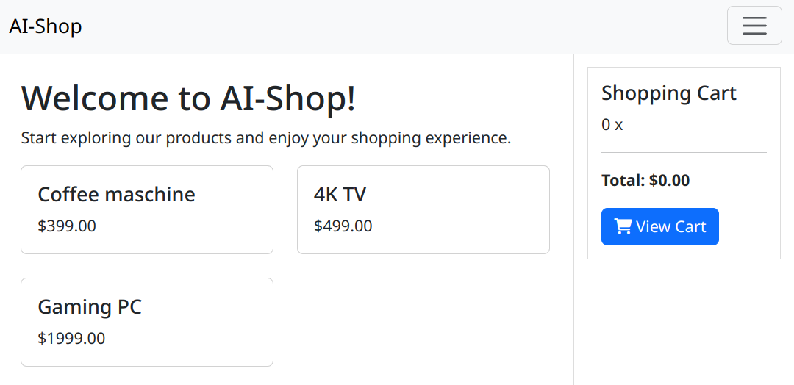
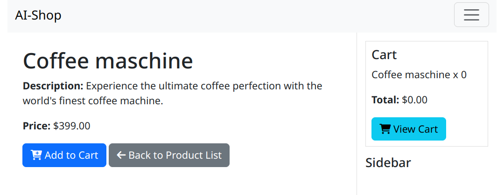
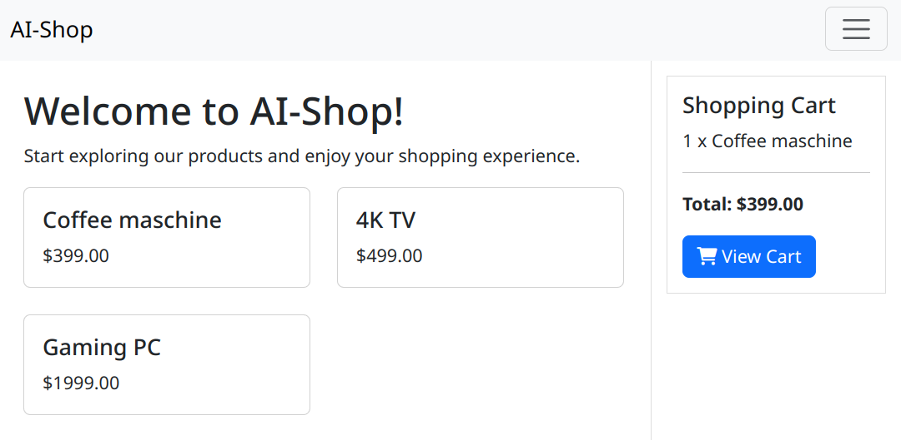
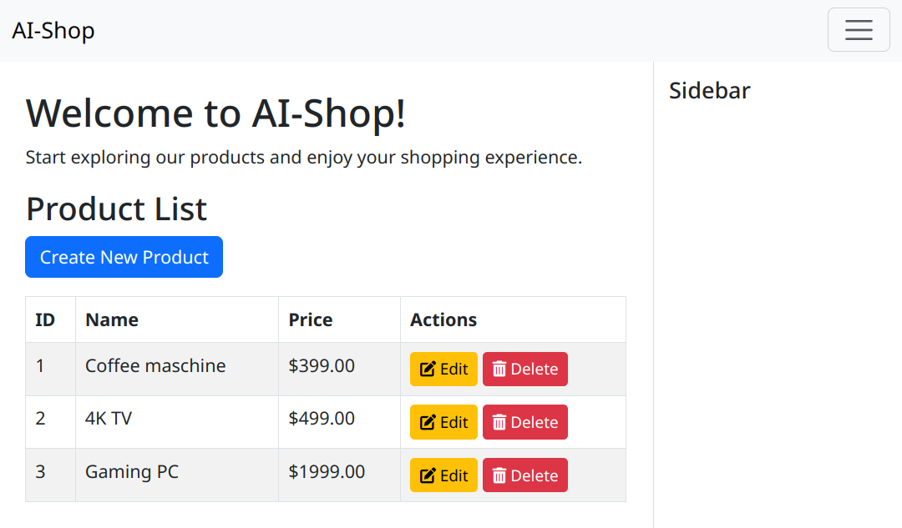
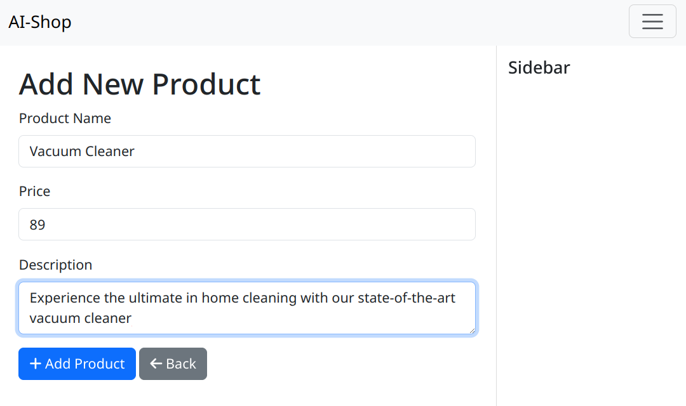
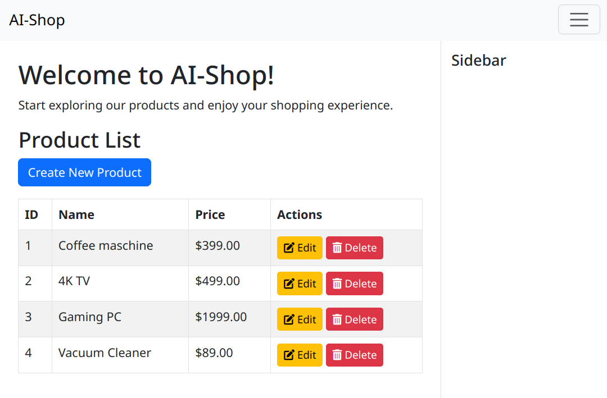

# AI-Shop: Ein experimenteller Ansatz zur Entwicklung von Unternehmensanwendungen mit Generativer KI


---

Dieser Artikel wurde mit Hilfe einer KI erstellt (Anthropic Claude 3.5 Sonnet)

---

In dieser Arbeit untersuchen wir einen fundamentalen Paradigmenwechsel in der Entwicklung von Unternehmensanwendungen: Die vollständige Simulation von Geschäftslogik durch Generative KI. Anders als bei konventionellen Implementierungen oder aktuellen KI-gestützten Ansätzen zur Code-Generierung, verfolgen wir hier die Strategie, das KI-Modell selbst als Anwendung fungieren zu lassen.

Wir präsentieren einen radikalen, möglicherweise kontroversen Ansatz zur Entwicklung von Unternehmensanwendungen. Während aktuelle KI-gestützte Entwicklungsansätze darauf abzielen, Programmcode zu generieren, gehen wir hier einen fundamentalen Schritt weiter - oder je nach Perspektive zur Seite. Die gesamte Business-Logik wird nicht mehr implementiert, sondern durch Gen-AI in Echtzeit simuliert.

Als konkretes Beispiel für diesen Ansatz haben wir ein E-Commerce-System implementiert. Ein Onlineshop eignet sich dabei besonders gut als Demonstrator, da er typische Eigenschaften von Unternehmensanwendungen aufweist: Eine klare Geschäftslogik, Zustandsverwaltung, und Benutzerinteraktionen. Die hier gewonnenen Erkenntnisse lassen sich auf andere Arten von Unternehmensanwendungen übertragen.

In unserer Implementation beschreiben wir beispielsweise Warenkorbfunktionen nicht mehr durch traditionellen Code, sondern durch natürlichsprachliche Anweisungen an das KI-Modell. Das Modell übernimmt dabei die Rolle des Anwendungssystems, verarbeitet Anfragen und verwaltet den Zustand - ohne dass eine einzige Zeile traditioneller Business-Logik implementiert werden muss. Dieser Ansatz reduziert die Codebasis auf ein absolutes Minimum und verlagert die gesamte Komplexität in natürlichsprachliche Prompts.

Die vorliegende Arbeit dokumentiert ein Experiment, das fundamentale Fragen aufwirft: Ist eine vollständige Simulation von Geschäftslogik durch Generative KI möglich? Wo liegen die Grenzen? Welche Implikationen ergeben sich für die Zukunft der Softwareentwicklung?

---

Der Quellcode dieses Projekts ist auf GitHub verfügbar: https://github.com/steva-gmbh/ai-shop

---

## Architektur: Shop-Features als Prompts

Die Kernidee besteht darin, Geschäftslogik nicht in Code zu implementieren, sondern in Form von präzisen Prompts zu beschreiben. Diese werden von der Generativen KI interpretiert und in entsprechende Aktionen umgesetzt. Die Architektur basiert auf einem Event-ähnlichen System: Jede Benutzeraktion wird in einen spezifischen Prompt übersetzt, der dann vom KI-Modell verarbeitet wird.

Der Datenfluss folgt dabei einem klaren Muster:
1. Benutzeraktion triggert einen HTTP-Request
2. Request wird in einen kontextspezifischen Prompt übersetzt
3. Das KI-Modell verarbeitet den Prompt unter Berücksichtigung des aktuellen System-Zustands
4. Die generierte Antwort wird validiert und in einen HTTP-Response transformiert

### Umsetzung der Geschäftslogik

Die eigentliche Geschäftslogik wird in unserem System durch einen innovativen Ansatz realisiert, bei dem das KI-Modell als "virtueller Prozessor" für Geschäftsregeln fungiert. Der Prozess basiert auf drei Kernkomponenten:

1. **Datenhaltung**: In unserer Proof-of-Concept Implementation verwenden wir eine einfache JSON-Datei als Datenbank. Diese enthält den kompletten Systemzustand (Produkte, Warenkorb, etc.). Das Format der Daten wird durch ein JSON-Schema definiert, welches die Struktur und Constraints des Datenmodells beschreibt.

2. **Geschäftsfunktionen**: Anstelle von traditionellem Code werden Geschäftsfunktionen als natürlichsprachliche Beschreibungen formuliert. Diese Beschreibungen spezifizieren präzise, wie die Daten zu modifizieren sind. Ein typischer Prompt enthält dabei:
   - Den aktuellen Systemzustand (komplette JSON-Daten)
   - Das JSON-Schema als Strukturdefinition
   - Die auszuführende Operation in natürlicher Sprache

3. **Zustandsänderungen**: Das KI-Modell verarbeitet diese Eingaben und generiert - dank des spezifizierten JSON-Schemas - ein neues, valides JSON-Objekt, das den aktualisierten Systemzustand repräsentiert.

Die technischen Komponenten des Systems, die als konventionelle Softwarefunktionen implementiert sind (wie UI-Generierung, Datenbankzugriff und Zustandsverwaltung), werden in der KI-Agenten-Terminologie als "KI-Tools" bezeichnet. Diese Tools stellen die notwendige Infrastruktur bereit, damit das KI-Modell mit der realen Welt interagieren und Systemressourcen verwalten kann.

Ein typischer Verarbeitungsablauf sieht wie folgt aus:

Ausgangszustand (JSON):
```json
{
  "products": [...],
  "cart": { "items": [] }
}
```

Prompt:
```ruby
"Systemzustand: [JSON-Daten]
Schema: [JSON-Schema]
Aktion: Füge Produkt XYZ zum Warenkorb hinzu..."
```

KI-Generiertes Ergebnis:
```json
{
  "products": [...],
  "cart": { "items": [{"product_id": "XYZ", "quantity": 1}] }
}
```

### Technische Implementation

Die Anwendung basiert auf einer schlanken Ruby-Codebasis (~250 LOC), die als Interface zwischen HTTP-Requests und der KI-API fungiert. Die Wahl der Programmiersprache spielt dabei keine wesentliche Rolle - die gleiche Implementierung wäre ebenso in Python, Kotlin oder jeder anderen modernen Programmiersprache möglich. Die eigentliche Geschäftslogik wird vollständig durch das KI-Modell abgebildet. Der Ruby-Code ist dabei in drei Hauptkomponenten unterteilt:

1. **Request Handler**: Verarbeitet eingehende HTTP-Requests und extrahiert relevante Parameter
2. **Prompt Manager**: Generiert kontextspezifische Prompts und verwaltet die KI-Kommunikation
3. **State Manager**: Verwaltet den JSON-basierten Systemzustand und validiert Änderungen

#### Beispiel 1: Frontend-Generierung

Die UI-Generierung erfolgt in einem zweistufigen Prozess: Zunächst werden HTML-Templates durch das Language Model generiert und zwischengespeichert. Diese Templates enthalten Mustache-Platzhalter für dynamische Inhalte. Bei einer konkreten Anfrage werden dann die Templates mit den aktuellen Daten aus der Datenbank zu vollständigen HTML-Seiten gerendert.

```ruby
"Zeige alle Produkte in einem Rasterlayout mit zwei Spalten an.
Für jedes Produkt zeige den Namen und den Preis an.
Ein Klick auf ein Produkt soll die URL '/products/:id' öffnen, wobei :id die ID des Produkts ist.
Zeige außerdem den Warenkorb oben in der rechten Seitenleiste an.
Der Warenkorb soll alle Produktnamen und deren Anzahl anzeigen, jeweils in einer Zeile.
Der Warenkorb soll auch die Gesamtsumme aller Produktpreise multipliziert mit den Produktanzahlen anzeigen.
Verwende Dollar als Währung.
Zeige im Warenkorb auch einen Button zum Anzeigen des Warenkorbs an. Die Button-URL ist '/cart'.
Zeichne einen Rahmen um den Warenkorb."
```
Das Language Model generiert daraus vollständige HTML-Templates mit entsprechendem Styling. Die generierten Templates werden gecached und nur bei Bedarf neu generiert. Bei einer HTTP-Anfrage werden die Templates dann mit den aktuellen Daten aus der JSON-Datenbank kombiniert, wobei die Mustache-Platzhalter durch die tatsächlichen Werte ersetzt werden.

Das generierte Template sieht vereinfacht wie folgt aus:
```html
<div class="container mt-4">
  <div class="row">
    <!-- Produktgrid -->
    <div class="col-md-9">
      <div class="row row-cols-1 row-cols-md-2 g-4">
        {{#products}}
        <div class="col">
          <div class="card h-100">
            <div class="card-body">
              <h5 class="card-title">{{name}}</h5>
              <p class="card-text text-truncate">{{description}}</p>
              <p class="card-text"><strong>${{price}}</strong></p>
              <a href="/products/{{id}}" class="btn btn-primary">
                <i class="fas fa-shopping-cart"></i> In den Warenkorb
              </a>
            </div>
          </div>
        </div>
        {{/products}}
      </div>
    </div>
    
    <!-- Warenkorb Sidebar -->
    <div class="col-md-3">
      <div class="card border-primary">
        <div class="card-header">
          <i class="fas fa-shopping-cart"></i> Warenkorb
        </div>
        <div class="card-body">
          {{#cart.items}}
          <div class="d-flex justify-content-between">
            <span>{{product.name}}</span>
            <span>{{quantity}}x</span>
          </div>
          {{/cart.items}}
          <hr>
          <div class="text-end">
            <strong>Gesamt: ${{cart.total}}</strong>
          </div>
          <a href="/cart" class="btn btn-primary mt-2">
            Zum Warenkorb
          </a>
        </div>
      </div>
    </div>
  </div>
</div>
```

#### Beispiel 2: Shop-Hauptseite

Die Generierung der Shop-Hauptseite demonstriert die grundlegende Arbeitsweise des Systems. Aus einem JSON-Zustand mit Produktdaten wird eine vollständige Webseite erzeugt:

Systemzustand:
```json
{
  "products": [
    {
      "id": "1",
      "name": "Coffee maschine",
      "price": 299,
      "description": "Experience the ultimate coffee perfection with the world's finest coffee machine."
    },
    {
      "id": "2",
      "name": "4K TV",
      "price": 499,
      "description": "Crystal clear picture quality for your home entertainment."
    },
    {
      "id": "3",
      "name": "Gaming PC",
      "price": 1999,
      "description": "High-performance gaming rig for the ultimate gaming experience."
    }
  ],
  "cart": { "items": [] }
}
```

Prompt an das Language Model:
```ruby
"Zeige alle Produkte in einem Rasterlayout mit zwei Spalten an.
Für jedes Produkt zeige den Namen und den Preis an.
Ein Klick auf ein Produkt soll die URL '/products/:id' öffnen, wobei :id die ID des Produkts ist.
Zeige außerdem den Warenkorb oben in der rechten Seitenleiste an.
Der Warenkorb soll alle Produktnamen und deren Anzahl anzeigen, jeweils in einer Zeile.
Der Warenkorb soll auch die Gesamtsumme aller Produktpreise multipliziert mit den Produktanzahlen anzeigen.
Verwende Dollar als Währung.
Zeige im Warenkorb auch einen Button zum Anzeigen des Warenkorbs an. Die Button-URL ist '/cart'.
Zeichne einen Rahmen um den Warenkorb."
```

Das Language Model generiert daraus ein vollständiges HTML-Template, das die Daten entsprechend den Vorgaben präsentiert.



#### Beispiel 3: Warenkorb-Management

Eine traditionelle Warenkorb-Implementation würde mehrere Funktionen und Methoden erfordern:
```ruby
# Traditionelle Implementation: ~50 LOC Business Logic
class Cart
  def add_product(product_id)
    # Produkt finden
    # Existenz prüfen
    # Warenkorb-Entry erstellen/updaten
    # Gesamtsumme neu berechnen
    # Validierungen durchführen
    # Events triggern
  end
end
```

In unserem Ansatz wird statt des Ruby-Codes ein Prompt für das Language Model verwendet:

```ruby
"Füge das Produkt mit der ID ':id' zum Warenkorb hinzu.
Falls das Produkt noch nicht im Warenkorb ist, setze die Produktanzahl auf eins.
Falls das Produkt bereits im Warenkorb ist, erhöhe die Produktanzahl um eins."
```

Das Language Model interpretiert diese Anweisung und führt die entsprechenden State-Änderungen im JSON-Datenmodell durch. Das System validiert dabei automatisch die Existenz des Produkts, handhabt Edge Cases und aktualisiert alle abhängigen Werte. Essentiell ist hierbei, dass bei jeder Anfrage das JSON-Schema an das Language Model mitgeliefert wird. Nur so kann sichergestellt werden, dass die generierte Antwort exakt dem erwarteten Datenbankschema entspricht und keine Inkonsistenzen in der Datenstruktur entstehen.

Der folgende JSON-Zustand zeigt den initialen Systemzustand mit einem leeren Warenkorb und einem verfügbaren Produkt:
```json
{
  "products": [
    {
      "id": "1",
      "name": "Coffee maschine",
      "price": 299,
      "description": "Experience the ultimate coffee perfection with the world's finest coffee machine."
    }
  ],
  "cart": {
    "items": []
  }
}
```



Nach Verarbeitung des Prompts durch das Language Model sieht der neue Systemzustand wie folgt aus, wobei das Produkt nun im Warenkorb enthalten ist:
```json
{
  "products": [
    {
      "id": "1",
      "name": "Coffee maschine",
      "price": 299,
      "description": "Experience the ultimate coffee perfection with the world's finest coffee machine."
    }
  ],
  "cart": {
    "items": [
      {
        "product_id": "1",
        "quantity": 1
      }
    ]
  }
}
```



#### Beispiel 4: Shop-Management

Die Verwaltung der Produkte demonstriert die Flexibilität des Systems bei der Generierung von Formularen und der Verarbeitung von Datenänderungen. Das System nutzt das JSON-Schema, um automatisch passende Eingabeformulare zu erstellen und Datenänderungen zu validieren.

Der folgende JSON-Zustand zeigt den initialen Systemzustand mit den vorhandenen Produkten:
```json
{
  "products": [
    {
      "id": "1",
      "name": "Coffee maschine",
      "price": 299,
      "description": "Experience the ultimate coffee perfection with the world's finest coffee machine."
    },
    {
      "id": "2",
      "name": "4K TV",
      "price": 499,
      "description": "Crystal clear picture quality for your home entertainment."
    },
    {
      "id": "3",
      "name": "Gaming PC",
      "price": 1999,
      "description": "High-performance gaming rig for the ultimate gaming experience."
    }
  ],
  "cart": { "items": [] }
}
```

Für die Anzeige der Produktübersicht wird folgender Prompt verwendet:
```ruby
"Display all products in a table one row for each product.
Display the id, name and price for each product.
Each product has a delete link with an icon.
The URL for the delete link is '/admin/product/:id/delete'. Use the id of the respective product for ':id'.
Each product has an edit link with an icon.
The URL for the edit link is '/admin/products/:id/edit'. Use the ID of the respective product for ':id'.
Display a button for creating a new product. The URL of the button is '/admin/products/new'."
```



Nach einem Klick auf "Create New Product" generiert das System ein Formular basierend auf dem JSON-Schema:
```ruby
"Display a form for entering a new product.
Include all product attributes except for the ID.
The action URL of the form is '/admin/products'.
Also add a back button to the form, that links to the URL '/admin/products'."
```



Nach dem Absenden des Formulars wird folgender Prompt verwendet, um die Datenbank zu aktualisieren:
```ruby
"Create a new product with these properties: '#{params.inspect}'"
```

Der neue Systemzustand nach dem Hinzufügen des Produkts:
```json
{
  "products": [
    {
      "id": "1",
      "name": "Coffee maschine",
      "price": 299,
      "description": "Experience the ultimate coffee perfection with the world's finest coffee machine."
    },
    {
      "id": "2",
      "name": "4K TV",
      "price": 499,
      "description": "Crystal clear picture quality for your home entertainment."
    },
    {
      "id": "3",
      "name": "Gaming PC",
      "price": 1999,
      "description": "High-performance gaming rig for the ultimate gaming experience."
    },
    {
      "id": "4",
      "name": "Vacuum Cleaner",
      "price": 89,
      "description": "Experience the ultimate in home cleaning with our state-of-the-art vacuum cleaner"
    }
  ],
  "cart": { "items": [] }
}
```



Das Language Model generiert nicht nur die Formulare und validiert die Eingaben, sondern stellt auch sicher, dass die Datenintegrität gewahrt bleibt. Neue IDs werden automatisch generiert und die Datenstruktur wird entsprechend dem Schema validiert.

### Skalierung auf Produktivsysteme

In einem realen Produktivsystem würde dieser Ansatz naturgemäß anders implementiert werden. Statt einer JSON-Datei würde eine robuste Datenbankarchitektur zum Einsatz kommen. Der Prozess würde sich dabei in mehrere Schritte aufteilen:

1. **Datenabruf**: Das KI-Modell würde zunächst SQL-Anweisungen generieren, um die relevanten Daten aus der Datenbank zu laden:
```sql
-- KI-generierte Abfrage
SELECT p.*, c.quantity 
FROM products p 
LEFT JOIN cart_items c ON p.id = c.product_id 
WHERE p.id = 'XYZ';
```

2. **Geschäftslogik**: Die geladenen Daten würden dann wie im Proof-of-Concept verarbeitet werden, wobei das KI-Modell die notwendigen Änderungen ermittelt.

3. **Datenaktualisierung**: Schließlich würde das KI-Modell die erforderlichen SQL-Anweisungen zur Aktualisierung der Datenbank generieren:
```sql
-- KI-generierte Updates
BEGIN TRANSACTION;
INSERT INTO cart_items (product_id, quantity) 
VALUES ('XYZ', 1)
ON CONFLICT (product_id) 
DO UPDATE SET quantity = quantity + 1;
COMMIT;
```

Dieser mehrstufige Prozess würde mehrere Vorteile bieten:
- Transaktionssicherheit
- Bessere Skalierbarkeit
- Effizientere Ressourcennutzung
- Präzisere Fehlerkontrolle
- Integration in bestehende Datenbankarchitekturen

Die Herausforderung liegt dabei in der korrekten Generierung und Validierung der SQL-Anweisungen sowie in der Gewährleistung der Datenkonsistenz über mehrere Operationen hinweg.

## Technischer Stack

Der technische Stack wurde bewusst minimal konzipiert, wobei jede Komponente spezifische Aufgaben optimal erfüllt. Ruby in Kombination mit Sinatra bildet das Fundament als leichtgewichtiges Web-Framework. Dieses ermöglicht ein minimales, aber effizientes Routing-System mit einfacher Middleware-Integration. Die schnelle Request-Verarbeitung und klare Separation of Concerns sind dabei zentrale Vorteile dieser Wahl.

Die Generative KI fungiert als Kernkomponente für die Logik- und UI-Generierung. Die kontextsensitive Prompt-Verarbeitung ermöglicht präzise Steuerung der generierten Ausgaben. Die integrierte JSON-Schema-Validierung gewährleistet die Datenintegrität, während die natürlichsprachliche Verarbeitung und automatische Code-Generierung die Entwicklung beschleunigen.

Für die Datenhaltung nutzen wir JSON als einfaches, aber effektives Speicherformat. Dies ermöglicht schnelles State-Management bei gleichzeitig hoher Lesbarkeit der Datenstrukturen. Die einfache Versionierung und direkte API-Kompatibilität sind weitere Vorteile dieses Formats. Die menschenlesbare Struktur erleichtert dabei Debugging und Entwicklung.

## Limitierungen

Die zentrale technische Herausforderung des Systems liegt in der extrem langen Verarbeitungszeit der Prompts durch das Language Model. Mit Bearbeitungszeiten von 10 bis 30 Sekunden für jeden einzelnen Prompt ist das System für interaktive Anwendungen praktisch unbrauchbar. Diese fundamentale Limitation ergibt sich aus der Komplexität der Prompt-Verarbeitung durch das KI-Modell und ist mit den aktuell verfügbaren Modellen nicht zu umgehen. Jede Benutzeraktion - sei es das Hinzufügen eines Produkts zum Warenkorb oder die Generierung einer Produktübersicht - erfordert eine vollständige Prompt-Verarbeitung, was zu inakzeptablen Wartezeiten für die Benutzer führt.

Die Kostenstruktur erfordert besondere Beachtung. Die API-Kosten skalieren linear mit der Nutzung, wobei komplexe Prompts besonders kostenintensiv sind. Die notwendige Prompt-Optimierung stellt einen kontinuierlichen Prozess dar, bei dem der Trade-off zwischen Präzision und Token-Verbrauch sorgfältig abgewogen werden muss. Die Kostenentwicklung ist dabei oft schwer vorherzusagen.

Im Bereich der technischen Risiken steht der Determinismus im Vordergrund. Potenzielle Inkonsistenzen bei identischen Prompts können zu unvorhersehbarem Systemverhalten führen. Die Abhängigkeit von einer externen API schafft zusätzliche Risiken. Die Versionierung von Prompts und Schema-Evolution stellen komplexe Herausforderungen dar, während die Error-Recovery besondere Aufmerksamkeit erfordert.

## Vorteile

Trotz dieser Limitierungen zeigt der Ansatz signifikantes Potenzial in spezifischen Anwendungsbereichen. Besonders im Rapid Prototyping und bei experimentellen Systemen können die Vorteile voll ausgespielt werden. Die Entwicklung von Proof-of-Concepts und Feature-Exploration profitiert von der Flexibilität des Systems. Auch im Bereich UI/UX-Experimente zeigt sich der Ansatz als besonders wertvoll.

Die minimale Codebasis stellt einen der bedeutendsten Vorteile unseres Ansatzes dar. Durch die Definition der gesamten Business-Logik mittels Prompts erreichen wir eine Reduzierung der zu wartenden Codebasis um etwa 90 Prozent. Dies eliminiert nicht nur den üblichen Boilerplate-Code, sondern führt auch zu einer selbstdokumentierenden Implementation. Das System behandelt Edge Cases automatisch, da diese bereits in den natürlichsprachlichen Beschreibungen berücksichtigt werden können.

Die Möglichkeit zur schnellen Iteration ist ein weiterer wesentlicher Vorteil. Neue Features können durch präzise natürlichsprachliche Beschreibungen implementiert werden, ohne dass CRUD-Operationen manuell programmiert werden müssen. Die automatische Generierung von UI-Komponenten beschleunigt den Entwicklungsprozess erheblich. Dies ermöglicht nicht nur schnelles Prototyping neuer Funktionalitäten, sondern auch effizientes A/B-Testing durch simple Variationen in den Prompts.

Ein besonders wichtiger Aspekt ist die verbesserte Kommunikation zwischen allen Beteiligten. Die Prompts fungieren als gemeinsame Sprache zwischen technischen und nicht-technischen Stakeholdern. Die natürlichsprachliche Dokumentation der Systemfunktionalität reduziert die Komplexität in der Kommunikation erheblich. User Stories können direkt in Funktionalität übersetzt werden, was das Requirements Engineering deutlich vereinfacht.

Die Technologie-Adaptivität des Systems ermöglicht eine bisher unerreichte Flexibilität. Framework-Wechsel können durch simple Prompt-Anpassungen realisiert werden, wobei Best Practices automatisch berücksichtigt werden. Die Integration neuer Technologien gestaltet sich wesentlich einfacher, da keine umfangreichen Code-Änderungen erforderlich sind. Anpassungen an Design-System-Änderungen können flexibel vorgenommen werden, und der Aufwand bei Tech-Stack-Updates reduziert sich erheblich.

## Zusammenfassung

Der AI-Shop demonstriert einen experimentellen Ansatz zur Softwareentwicklung, bei dem traditioneller Code durch natürlichsprachliche Prompts ersetzt wird. Die Implementation zeigt sowohl die Möglichkeiten als auch die Grenzen des Einsatzes von LLMs in der Softwareentwicklung.

Die Ergebnisse unserer Experimente machen jedoch deutlich, dass dieser Ansatz für den produktiven Einsatz derzeit vollkommen ungeeignet ist. Die Verarbeitungszeiten von 10 bis 30 Sekunden pro Request sind für interaktive Anwendungen inakzeptabel. Der extreme Energieverbrauch durch die rechenintensiven KI-Operationen steht im Widerspruch zu Nachhaltigkeitsanforderungen moderner Softwaresysteme. Besonders kritisch ist der inhärent nicht-deterministische Charakter des Systems: Identische Anfragen können zu unterschiedlichen Zeitpunkten verschiedene Ergebnisse produzieren, was fundamentalen Anforderungen an Unternehmensanwendungen wie Vorhersagbarkeit, Testbarkeit und Reproduzierbarkeit widerspricht.

Diese Probleme sind nicht durch simple Optimierungen zu lösen, sondern stellen fundamentale Limitierungen des Ansatzes dar. Der Versuch, Geschäftslogik durch ein KI-Modell zu simulieren, führt zu einem System, das zwar konzeptionell interessant ist, aber für reale Anwendungsfälle nicht praktikabel ist. Die hohen Latenzzeiten, der massive Ressourcenverbrauch und die fehlende Determinismus machen deutlich, dass dieser Ansatz in seiner jetzigen Form keine realistische Alternative zu traditioneller Softwareentwicklung darstellt.

Während das System für Produktivumgebungen also nicht geeignet ist, zeigt es dennoch interessante Perspektiven für die Zukunft der Softwareentwicklung auf, insbesondere im Bereich der Low-Code/No-Code Entwicklung mit KI-Unterstützung. Die Erfahrungen aus diesem Projekt liefern wertvolle Erkenntnisse für die Integration von KI-Systemen in den Softwareentwicklungsprozess - vor allem auch darüber, wo die Grenzen dieser Integration aktuell liegen.
