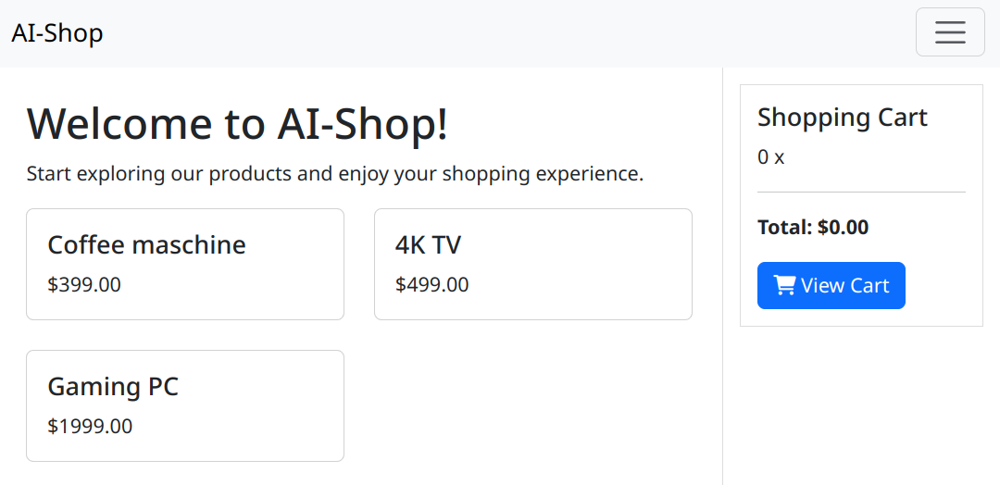
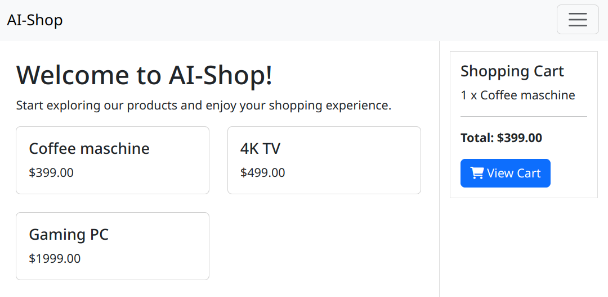
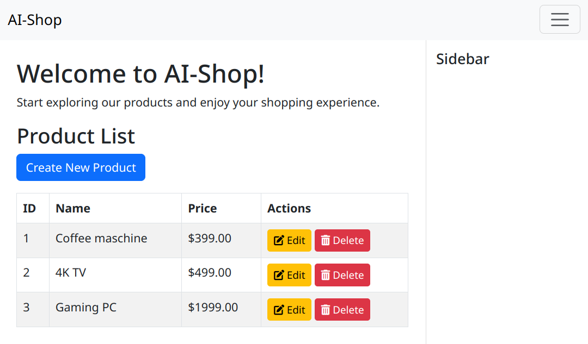
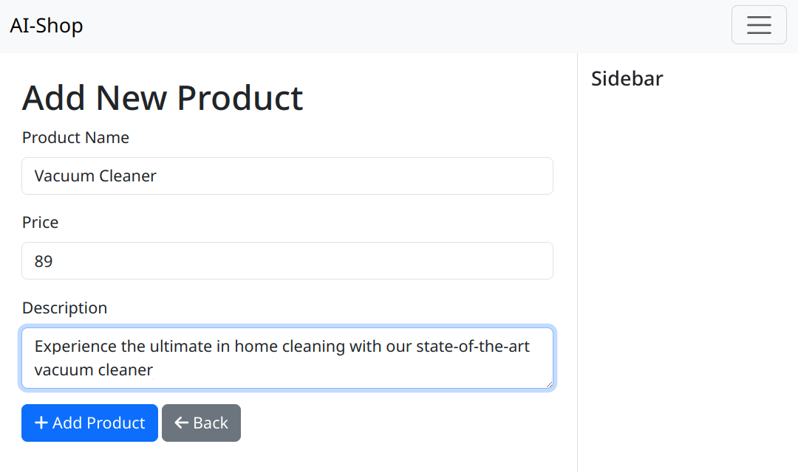
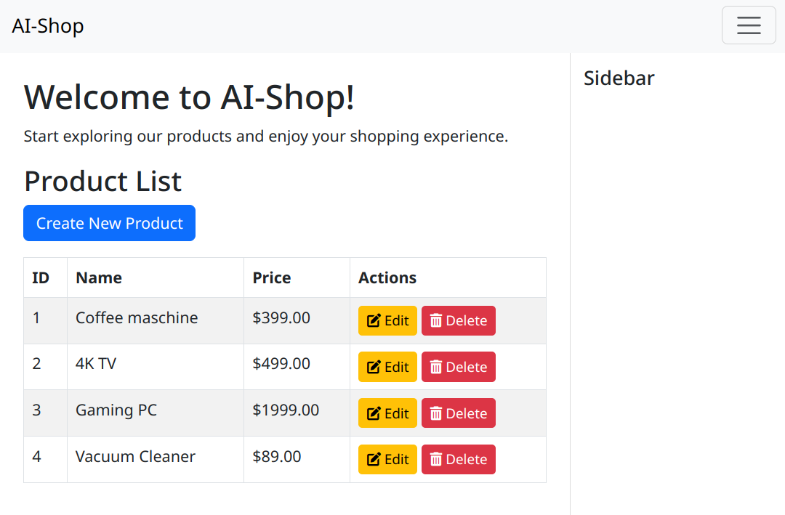

# AI-Shop: An Experimental Approach to Enterprise Application Development with Generative AI


---

This article was created with the help of an AI (Anthropic Claude 3.5 Sonnet)

---

In this work, we examine a fundamental paradigm shift in enterprise application development: The complete simulation of business logic through Generative AI. Unlike conventional implementations or current AI-supported approaches to code generation, we pursue the strategy of having the AI model itself function as the application.

We present a radical, possibly controversial approach to enterprise application development. While current AI-supported development approaches aim to generate program code, we take a fundamental step further - or depending on perspective, to the side. The entire business logic is no longer implemented but simulated in real-time by Gen-AI.

As a concrete example of this approach, we have implemented an e-commerce system. An online shop is particularly well-suited as a demonstrator as it exhibits typical characteristics of enterprise applications: Clear business logic, state management, and user interactions. The insights gained here can be applied to other types of enterprise applications.

In our implementation, for example, we no longer describe shopping cart functions through traditional code, but through natural language instructions to the AI model. The model takes on the role of the application system, processes requests, and manages the state - without requiring a single line of traditional business logic to be implemented. This approach reduces the codebase to an absolute minimum and shifts all complexity into natural language prompts.

The present work documents an experiment that raises fundamental questions: Is a complete simulation of business logic through Generative AI possible? Where are the limits? What implications arise for the future of software development?

---

The source code of this project is available on GitHub: https://github.com/steva-gmbh/ai-shop

---

## Architecture: Shop Features as Prompts

The core idea is to describe business logic not in code but in the form of precise prompts. These are interpreted by the Generative AI and translated into corresponding actions. The architecture is based on an event-like system: Each user action is translated into a specific prompt, which is then processed by the AI model.

The data flow follows a clear pattern:
1. User action triggers an HTTP request
2. Request is translated into a context-specific prompt
3. The AI model processes the prompt considering the current system state
4. The generated response is validated and transformed into an HTTP response

### Implementation of Business Logic

The actual business logic is realized in our system through an innovative approach where the AI model acts as a "virtual processor" for business rules. The process is based on three core components:

1. **Data Storage**: In our proof-of-concept implementation, we use a simple JSON file as a database. This contains the complete system state (products, shopping cart, etc.). The format of the data is defined by a JSON schema that describes the structure and constraints of the data model.

2. **Business Functions**: Instead of traditional code, business functions are formulated as natural language descriptions. These descriptions specify precisely how the data should be modified. A typical prompt contains:
   - The current system state (complete JSON data)
   - The JSON schema as structure definition
   - The operation to be executed in natural language

3. **State Changes**: The AI model processes these inputs and generates - thanks to the specified JSON schema - a new, valid JSON object that represents the updated system state.

The technical components of the system that are implemented as conventional software functions (such as UI generation, database access, and state management) are referred to as "AI-Tools" in the AI Agent parlance. These tools provide the necessary infrastructure for the AI model to interact with the real world and manage system resources.

A typical processing flow looks like this:

Initial state (JSON):
```json
{
  "products": [...],
  "cart": { "items": [] }
}
```

Prompt:
```ruby
"System state: [JSON data]
Schema: [JSON schema]
Action: Add product XYZ to shopping cart..."
```

AI-Generated Result:
```json
{
  "products": [...],
  "cart": { "items": [{"product_id": "XYZ", "quantity": 1}] }
}
```

### Technical Implementation

The application is based on a lean Ruby codebase (~250 LOC) that functions as an interface between HTTP requests and the AI API. The choice of programming language plays no significant role - the same implementation would be equally possible in Python, Kotlin, or any other modern programming language. The actual business logic is completely mapped by the AI model. The Ruby code is divided into three main components:

1. **Request Handler**: Processes incoming HTTP requests and extracts relevant parameters
2. **Prompt Manager**: Generates context-specific prompts and manages AI communication
3. **State Manager**: Manages the JSON-based system state and validates changes

#### Example 1: Frontend Generation

The UI generation occurs in a two-stage process: First, HTML templates are generated by the Language Model and cached. These templates contain Mustache placeholders for dynamic content. During a concrete request, the templates are then rendered into complete HTML pages with the current data from the database.

```ruby
"Display all products in a grid layout with two columns.
For each product, show the name and price.
A click on a product should open the URL '/products/:id', where :id is the product's ID.
Also show the shopping cart in the top right sidebar.
The shopping cart should display all product names and their quantities, each in a line.
The shopping cart should also show the total sum of all product prices multiplied by product quantities.
Use dollars as currency.
Show a button in the shopping cart to display the cart. The button URL is '/cart'.
Draw a border around the shopping cart."
```
The Language Model generates complete HTML templates with corresponding styling from this. The generated templates are cached and only regenerated when needed. During an HTTP request, the templates are then combined with the current data from the JSON database, where Mustache placeholders are replaced with actual values.

The generated template looks simplified like this:
```html
<div class="container mt-4">
  <div class="row">
    <!-- Product grid -->
    <div class="col-md-9">
      <div class="row row-cols-1 row-cols-md-2 g-4">
        {{#products}}
        <div class="col">
          <div class="card h-100">
            <div class="card-body">
              <h5 class="card-title">{{name}}</h5>
              <p class="card-text text-truncate">{{description}}</p>
              <p class="card-text"><strong>${{price}}</strong></p>
              <a href="/products/{{id}}" class="btn btn-primary">
                <i class="fas fa-shopping-cart"></i> Add to Cart
              </a>
            </div>
          </div>
        </div>
        {{/products}}
      </div>
    </div>
    
    <!-- Shopping Cart Sidebar -->
    <div class="col-md-3">
      <div class="card border-primary">
        <div class="card-header">
          <i class="fas fa-shopping-cart"></i> Shopping Cart
        </div>
        <div class="card-body">
          {{#cart.items}}
          <div class="d-flex justify-content-between">
            <span>{{product.name}}</span>
            <span>{{quantity}}x</span>
          </div>
          {{/cart.items}}
          <hr>
          <div class="text-end">
            <strong>Total: ${{cart.total}}</strong>
          </div>
          <a href="/cart" class="btn btn-primary mt-2">
            View Cart
          </a>
        </div>
      </div>
    </div>
  </div>
</div>
```

#### Example 2: Shop Main Page

The generation of the shop main page demonstrates the basic working method of the system. A complete webpage is generated from a JSON state with product data:

System state:
```json
{
  "products": [
    {
      "id": "1",
      "name": "Coffee machine",
      "price": 299,
      "description": "Experience the ultimate coffee perfection with the world's finest coffee machine."
    },
    {
      "id": "2",
      "name": "4K TV",
      "price": 499,
      "description": "Crystal clear picture quality for your home entertainment."
    },
    {
      "id": "3",
      "name": "Gaming PC",
      "price": 1999,
      "description": "High-performance gaming rig for the ultimate gaming experience."
    }
  ],
  "cart": { "items": [] }
}
```

Prompt to the Language Model:
```ruby
"Display all products in a grid layout with two columns.
For each product, show the name and price.
A click on a product should open the URL '/products/:id', where :id is the product's ID.
Also show the shopping cart in the top right sidebar.
The shopping cart should display all product names and their quantities, each in a line.
The shopping cart should also show the total sum of all product prices multiplied by product quantities.
Use dollars as currency.
Show a button in the shopping cart to display the cart. The button URL is '/cart'.
Draw a border around the shopping cart."
```

The Language Model generates a complete HTML template that presents the data according to the specifications.



#### Example 3: Shopping Cart Management

A traditional shopping cart implementation would require multiple functions and methods:
```ruby
# Traditional implementation: ~50 LOC Business Logic
class Cart
  def add_product(product_id)
    # Find product
    # Check existence
    # Create/update cart entry
    # Recalculate total
    # Perform validations
    # Trigger events
  end
end
```

In our approach, instead of Ruby code, a prompt for the Language Model is used:

```ruby
"Add the product with ID ':id' to the shopping cart.
If the product is not yet in the cart, set the product quantity to one.
If the product is already in the cart, increase the product quantity by one."
```

The Language Model interprets this instruction and performs the corresponding state changes in the JSON data model. The system automatically validates the existence of the product, handles edge cases, and updates all dependent values. Essential here is that the JSON schema is provided to the Language Model with each request. Only this ensures that the generated response exactly matches the expected database schema and no inconsistencies arise in the data structure.

The following JSON state shows the initial system state with an empty shopping cart and an available product:
```json
{
  "products": [
    {
      "id": "1",
      "name": "Coffee machine",
      "price": 299,
      "description": "Experience the ultimate coffee perfection with the world's finest coffee machine."
    }
  ],
  "cart": {
    "items": []
  }
}
```


After processing the prompt by the Language Model, the new system state looks like this, with the product now contained in the cart:
```json
{
  "products": [
    {
      "id": "1",
      "name": "Coffee machine",
      "price": 299,
      "description": "Experience the ultimate coffee perfection with the world's finest coffee machine."
    }
  ],
  "cart": {
    "items": [
      {
        "product_id": "1",
        "quantity": 1
      }
    ]
  }
}
```



#### Example 4: Shop Management

The management of products demonstrates the system's flexibility in generating forms and processing data changes. The system uses the JSON schema to automatically create appropriate input forms and validate data changes.

The following JSON state shows the initial system state with the existing products:
```json
{
  "products": [
    {
      "id": "1",
      "name": "Coffee machine",
      "price": 299,
      "description": "Experience the ultimate coffee perfection with the world's finest coffee machine."
    },
    {
      "id": "2",
      "name": "4K TV",
      "price": 499,
      "description": "Crystal clear picture quality for your home entertainment."
    },
    {
      "id": "3",
      "name": "Gaming PC",
      "price": 1999,
      "description": "High-performance gaming rig for the ultimate gaming experience."
    }
  ],
  "cart": { "items": [] }
}
```

For displaying the product overview, the following prompt is used:
```ruby
"Display all products in a table one row for each product.
Display the id, name and price for each product.
Each product has a delete link with an icon.
The URL for the delete link is '/admin/product/:id/delete'. Use the id of the respective product for ':id'.
Each product has an edit link with an icon.
The URL for the edit link is '/admin/products/:id/edit'. Use the ID of the respective product for ':id'.
Display a button for creating a new product. The URL of the button is '/admin/products/new'."
```



After clicking "Create New Product", the system generates a form based on the JSON schema:
```ruby
"Display a form for entering a new product.
Include all product attributes except for the ID.
The action URL of the form is '/admin/products'.
Also add a back button to the form, that links to the URL '/admin/products'."
```



After submitting the form, the following prompt is used to update the database:
```ruby
"Create a new product with these properties: '#{params.inspect}'"
```

The new system state after adding the product:
```json
{
  "products": [
    {
      "id": "1",
      "name": "Coffee machine",
      "price": 299,
      "description": "Experience the ultimate coffee perfection with the world's finest coffee machine."
    },
    {
      "id": "2",
      "name": "4K TV",
      "price": 499,
      "description": "Crystal clear picture quality for your home entertainment."
    },
    {
      "id": "3",
      "name": "Gaming PC",
      "price": 1999,
      "description": "High-performance gaming rig for the ultimate gaming experience."
    },
    {
      "id": "4",
      "name": "Vacuum Cleaner",
      "price": 89,
      "description": "Experience the ultimate in home cleaning with our state-of-the-art vacuum cleaner"
    }
  ],
  "cart": { "items": [] }
}
```



The Language Model not only generates the forms and validates the inputs but also ensures that data integrity is maintained. New IDs are automatically generated and the data structure is validated according to the schema.

### Scaling to Production Systems

In a real production system, this approach would naturally be implemented differently. Instead of a JSON file, a robust database architecture would be used. The process would be divided into several steps:

1. **Data Retrieval**: The AI model would first generate SQL statements to load the relevant data from the database:
```sql
-- AI-generated query
SELECT p.*, c.quantity 
FROM products p 
LEFT JOIN cart_items c ON p.id = c.product_id 
WHERE p.id = 'XYZ';
```

2. **Business Logic**: The loaded data would then be processed as in the proof-of-concept, with the AI model determining the necessary changes.

3. **Data Update**: Finally, the AI model would generate the required SQL statements to update the database:
```sql
-- AI-generated updates
BEGIN TRANSACTION;
INSERT INTO cart_items (product_id, quantity) 
VALUES ('XYZ', 1)
ON CONFLICT (product_id) 
DO UPDATE SET quantity = quantity + 1;
COMMIT;
```

This multi-stage process would offer several advantages:
- Transaction safety
- Better scalability
- More efficient resource utilization
- More precise error control
- Integration into existing database architectures

The challenge lies in the correct generation and validation of SQL statements and ensuring data consistency across multiple operations.

## Technical Stack

The technical stack was deliberately conceived minimally, with each component optimally fulfilling specific tasks. Ruby in combination with Sinatra forms the foundation as a lightweight web framework. This enables a minimal but efficient routing system with simple middleware integration. The fast request processing and clear separation of concerns are central advantages of this choice.

The Generative AI functions as a core component for logic and UI generation. The context-sensitive prompt processing enables precise control of the generated outputs. The integrated JSON schema validation ensures data integrity, while natural language processing and automatic code generation accelerate development.

For data storage, we use JSON as a simple but effective storage format. This enables fast state management while maintaining high readability of data structures. The simple versioning and direct API compatibility are additional advantages of this format. The human-readable structure facilitates debugging and development.

## Limitations

The central technical challenge of the system lies in the extremely long processing time of prompts by the Language Model. With processing times of 10 to 30 seconds for each individual prompt, the system is practically unusable for interactive applications. This fundamental limitation arises from the complexity of prompt processing by the AI model and cannot be circumvented with currently available models. Every user action - be it adding a product to the cart or generating a product overview - requires complete prompt processing, leading to unacceptable waiting times for users.

The cost structure requires special attention. The API costs scale linearly with usage, with complex prompts being particularly cost-intensive. The necessary prompt optimization represents a continuous process where the trade-off between precision and token consumption must be carefully weighed. Cost development is often difficult to predict.

In terms of technical risks, determinism is at the forefront. Potential inconsistencies with identical prompts can lead to unpredictable system behavior. The dependency on an external API creates additional risks. The versioning of prompts and schema evolution present complex challenges, while error recovery requires special attention.

## Advantages

Despite these limitations, the approach shows significant potential in specific application areas. Particularly in rapid prototyping and experimental systems, the advantages can be fully utilized. The development of proof-of-concepts and feature exploration benefits from the system's flexibility. The approach also proves particularly valuable in the area of UI/UX experiments.

The minimal codebase represents one of the most significant advantages of our approach. By defining the entire business logic through prompts, we achieve a reduction in the codebase to be maintained by about 90 percent. This not only eliminates the usual boilerplate code but also leads to a self-documenting implementation. The system handles edge cases automatically, as these can already be considered in the natural language descriptions.

The ability for rapid iteration is another essential advantage. New features can be implemented through precise natural language descriptions without having to manually program CRUD operations. The automatic generation of UI components significantly accelerates the development process. This enables not only rapid prototyping of new functionalities but also efficient A/B testing through simple variations in the prompts.

A particularly important aspect is improved communication between all stakeholders. The prompts serve as a common language between technical and non-technical stakeholders. The natural language documentation of system functionality significantly reduces complexity in communication. User stories can be directly translated into functionality, which greatly simplifies requirements engineering.

The technology adaptivity of the system enables unprecedented flexibility. Framework changes can be realized through simple prompt adjustments, with best practices automatically considered. The integration of new technologies becomes much simpler as no extensive code changes are required. Adjustments to design system changes can be made flexibly, and the effort for tech stack updates is significantly reduced.

## Summary

The AI-Shop demonstrates an experimental approach to software development where traditional code is replaced by natural language prompts. The implementation shows both the possibilities and limitations of using LLMs in software development.

However, the results of our experiments make it clear that this approach is currently completely unsuitable for productive use. The processing times of 10 to 30 seconds per request are unacceptable for interactive applications. The extreme energy consumption through computationally intensive AI operations contradicts sustainability requirements of modern software systems. Particularly critical is the inherently non-deterministic character of the system: Identical requests can produce different results at different times, which contradicts fundamental requirements for enterprise applications such as predictability, testability, and reproducibility.

These problems cannot be solved through simple optimizations but represent fundamental limitations of the approach. The attempt to simulate business logic through an AI model leads to a system that, while conceptually interesting, is not practical for real use cases. The high latency times, massive resource consumption, and lack of determinism make it clear that this approach in its current form does not represent a realistic alternative to traditional software development.

While the system is thus not suitable for production environments, it nevertheless shows interesting perspectives for the future of software development, particularly in the area of low-code/no-code development with AI support. The experiences from this project provide valuable insights for the integration of AI systems into the software development process - especially about where the limits of this integration currently lie.

## Running the application

To run the AI Shop application, you'll need Ruby (version 3.0 or higher) and the Bundler gem installed on your system. You'll also need an OpenAI API key for the AI functionality.

### Prerequisites

1. Install Ruby:
   - **Linux**: Use your distribution's package manager
     ```bash
     # Ubuntu/Debian
     sudo apt-get install ruby ruby-dev
     
     # Fedora
     sudo dnf install ruby ruby-devel
     
     # Arch Linux
     sudo pacman -S ruby
     ```
   - **macOS**: Use Homebrew
     ```bash
     brew install ruby
     ```
   - **Windows**: Download the installer from [RubyInstaller](https://rubyinstaller.org/)

2. Install Bundler:
   ```bash
   gem install bundler
   ```

### Setup

1. Clone the repository:
   ```bash
   git clone https://github.com/grappendorf/ai-shop.git
   cd ai-shop
   ```

2. Install dependencies:
   ```bash
   bundle install
   ```

3. Set up your OpenAI API key:
   - **Linux/macOS**:
     ```bash
     export OPENAI_API_KEY='your-api-key-here'
     ```
   - **Windows** (Command Prompt):
     ```cmd
     set OPENAI_API_KEY=your-api-key-here
     ```
   - **Windows** (PowerShell):
     ```powershell
     $env:OPENAI_API_KEY='your-api-key-here'
     ```

### Running the Shop

1. Start the application:
   ```bash
   bundle exec ruby shop.rb
   ```

2. Open your web browser and navigate to:
   ```
   http://localhost:4567
   ```

### Development Mode

For development, you can run the application with automatic code reloading:

```bash
bundle exec rerun 'ruby shop.rb'
```

### Troubleshooting

- If you encounter permission errors on Linux/macOS while installing gems, you may need to use `sudo` or install Ruby through a version manager like `rbenv` or `rvm`
- On Windows, make sure Ruby is added to your PATH during installation
- If the application fails to start, check that:
  - All dependencies are installed (`bundle install`)
  - The OpenAI API key is correctly set
  - Port 4567 is not in use by another application
